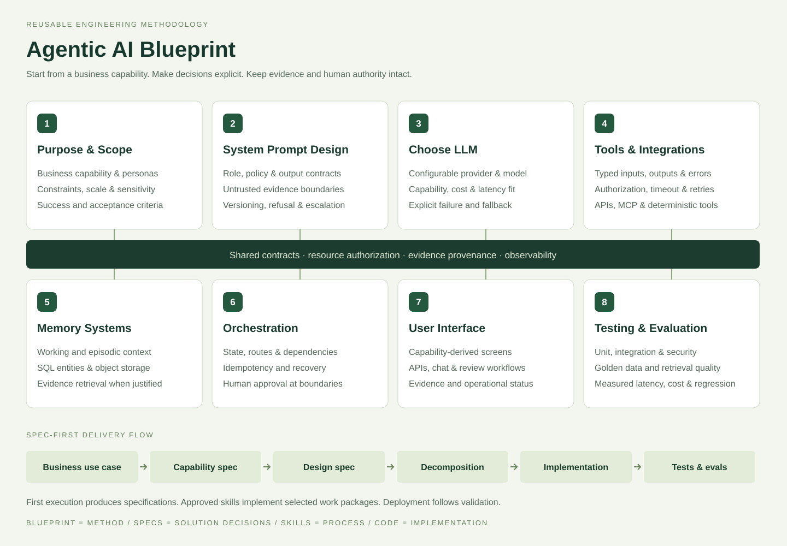

# Agentic AI Blueprint

[](https://github.com/jpnaidu07/agentic-ai-blueprint/actions/workflows/ci.yml)
[](https://www.python.org/)
[](LICENSE)

A reusable, spec-first method for turning a business use case into reviewed
capabilities, architecture and dependency-aware engineering work. The repository
also includes a runnable **development reference** for government tender evidence
review. It does not claim production certification or automate procurement awards.



## Why spec first

A model can generate convincing code before requirements, authorization and
acceptance criteria are understood. This project makes those decisions reviewable:

```text
Business use case
  → Capability specification        what the system must accomplish
  → Design specification            how the eight modules satisfy it
  → Decomposition specification     dependent, testable work packages
  → Approved engineering skills     selected implementation work
  → Tests and repeatable evaluations
  → Deployment gates
```

Generate the specs all at once or stop after capability/design. Then use the
guided coding-agent workflow to **explain → implement → test → record evidence**
for all tasks, the next step, a skill or a numbered blueprint section. The CLI
prepares plans and enforces evidence gates; the coding agent/developer writes code.

## Eight modules

| # | Module | Decisions captured |
|---:|---|---|
| 1 | Purpose & Scope | Business capability, personas, constraints, sensitivity, success and acceptance |
| 2 | System Prompt Design | Goals, policy, schemas, untrusted-data boundary, refusal, evidence and versioning |
| 3 | Choose LLM | Provider/model capability, context, sampling, latency/cost preference and explicit fallback |
| 4 | Tools & Integrations | Typed contracts, auth, resource boundaries, timeout, retry and errors |
| 5 | Memory Systems | Working context, relational entities, documents, retrieval and workflow state |
| 6 | Orchestration | Routes, dependencies, idempotency, recovery, long work and human approval |
| 7 | User Interface | Capability-derived screens/APIs, evidence and operational states |
| 8 | Testing & Evaluation | Unit/API/security tests, golden data, retrieval quality, latency and observed usage |

## Run it in ten minutes

Windows container workflow:

```powershell
git clone https://github.com/jpnaidu07/agentic-ai-blueprint.git
cd agentic-ai-blueprint
./setup.ps1
./run.ps1
```

Open [http://127.0.0.1:8000](http://127.0.0.1:8000). Setup checks Git, Docker
daemon and Compose, creates unique ignored local identities, validates Compose and
builds the app. It does not install host services or pull a local LLM.

A Python-only route is available:

```powershell
./setup.ps1 -LocalPython
./run.ps1 -LocalPython
```

See [development setup](docs/setup.md) for Windows/WSL2, Linux/macOS, security,
identity and resource-limit details.

## Use it for another problem

Copy the input contract and replace every example decision with your use case:

```powershell
Copy-Item templates/use-case.yaml customer-returns.yaml
# Edit problem, personas, journeys, requirements, rules, risks and acceptance.
agent-blueprint create customer-returns.yaml
agent-blueprint validate customer-returns
# Alternatively, for a NEW solution: create customer-returns.yaml --through capability
# Then: spec customer-returns design; spec customer-returns decomposition
```

The result is:

```text
solutions/customer-returns/
├── use-case.yaml
├── capability/
│   ├── capability.yaml
│   └── capability-spec.md
├── design/
│   ├── architecture.yaml
│   └── design-spec.md
└── decomposition/
    ├── tasks.yaml
    └── decomposition-spec.md
```

Review the proposals, resolve open questions, revise technology decisions, refresh
upstream digests and record local approval. Then request only selected work:

```powershell
agent-blueprint approve customer-returns --reviewer your-name
agent-blueprint run customer-returns all
# Or: run customer-returns next / database / backend / TASK-CAP-DATA
# Or one blueprint section: run customer-returns --module 5
agent-blueprint status customer-returns
```

A `run` command creates a teaching/execution plan, with dependency order and
ready/blocked status. Ask your coding agent to use
[blueprint-workflow](.agents/skills/blueprint-workflow/SKILL.md) to teach and implement
the plan. `agent-blueprint complete` records evidence after actual implementation;
stale specs, evidence or upstream receipts invalidate downstream work.

See [the guided workflow](docs/workflow.md) for exact prompts, staged spec commands,
all/next/task/skill/section selection, database work, manual prerequisite reporting
and the government tender walkthrough. Existing tender specs are already present:
start with `agent-blueprint guide government-tender-processing`, not `create`.

The template accepts any business domain that can be expressed through its strict
use-case schema. It does not infer a complete legal/business policy from one line
of prose. That would conceal assumptions. Start with the example and keep unknowns
in `open_questions`.

Reusable skill instructions live under `skills/`. Generated solution decisions
remain under `solutions/`; neither is embedded into the other.

## Government tender reference

[Government Tender Intelligence & Bid Evaluation](solutions/government-tender-processing/)
proves the framework against a document-heavy, controlled workflow:

- authenticated admin, evaluator, reviewer and viewer roles with tender scope;
- bounded digital-PDF validation, page text, chunks and original SHA-256;
- immutable human-reviewed facts with exact quotes and document/page references;
- lexical evidence retrieval with a supplied-embedding hybrid extension;
- mandatory eligibility, Decimal weighted scoring, L1 comparison and equal ties;
- missing/low-confidence evidence blocks ranking; ineligible bids set no baseline;
- idempotent, version-bound evaluations and independent stale-safe decisions;
- append-only facts/decisions and a verifiable per-tender audit hash chain;
- a responsive portal for portfolios, bidders, documents, scores and audit history.

The model-assisted path produces proposals only. It cannot accept evidence, change
criteria, calculate policy outside the deterministic engine, approve an evaluation
or issue an award. Read the [design decisions and limitations](solutions/government-tender-processing/design/architecture-notes.md)
and [architecture diagrams](solutions/government-tender-processing/design/diagrams/README.md).

## Model providers

The adapter supports OpenAI, Azure OpenAI, Gemini, Anthropic and Ollama compatibility
endpoints plus explicit OpenAI-compatible bases. Model names, keys, context and
capability flags come from environment configuration. There is no silent fallback
from provider failure to mock output; `mock` is an explicit infrastructure demo.

Compatibility does not mean feature equivalence. In particular, Anthropic's
compatibility layer ignores `response_format`, so tender schema extraction rejects
that route pending a native adapter. Read [provider contracts](docs/providers.md)
before enabling `ALLOW_DOCUMENT_LLM`. Cloud and local inference are optional for
manual fact review, deterministic scoring and offline tests.

## Verification

```powershell
python -m ruff check src scripts
python -m ruff format --check src scripts
python -m pytest -q
python -m src.evals.eval_harness
python -m scripts.validate_repo
python -m pip_audit -r requirements.txt
docker compose config --quiet
```

Offline evaluations report actual case counts and measured runtime against the
versioned synthetic dataset. They do not invent accuracy, hallucination, speed or
cost claims. The [validation report](docs/validation-report.md) separates local
evidence from CI and production gaps.

## Existing infrastructure demos

The three earlier examples remain under `src/solutions/`:

- disk telemetry triage;
- canary patch planning;
- distributed log correlation.

They are explicit offline simulations over synthetic fixtures, useful for tool,
idempotency and orchestration examples. They are not live Dell OME, ServiceNow,
ChromaDB, Slack, Discord or production benchmark integrations. Simulation routes
are authenticated and disabled unless `ENABLE_DEMO_ROUTES=true`.
Their `MCPServer` class is a schema-validated local catalog; no stdio/HTTP MCP
transport is claimed. A real transport needs an approved tools work package,
authentication and a resource boundary.

## Repository map

```text
blueprint/           strict contracts and JSON Schemas
templates/           reusable use-case input
skills/              reusable engineering processes
solutions/           solution-specific specs, reference data and evidence
src/blueprint/       spec compiler, approval and dependency gates
src/tender/          runnable tender reference
src/agent/           provider adapter and bounded legacy simulation
src/tests/           contract, API, security and concurrency tests
docs/                setup, providers, findings and blueprint diagram
scripts/             environment, schemas, validation and SVG generation
docker-compose.yml   bounded development stack
```

## Security and scope

Use synthetic data until identity, TLS, encryption, malware scanning, isolated
document parsing, secrets management, backups, external audit anchoring, rate
limits, retention/residency, model quality and procurement/legal controls are
approved and independently tested. See [security policy](SECURITY.md).

Licensed under the [MIT License](LICENSE).
