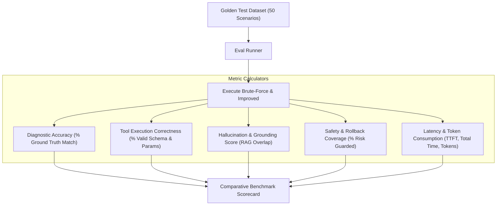

# 📊 Component Specification: Evaluation & Benchmarking Harness

## 1. Overview & Objectives
The **Evaluation Harness** (`src/evals/eval_harness.py`) provides quantitative, automated validation of agentic workflows. It ensures that improvements in planning, tool calling, and RAG translate to measurable gains in accuracy, safety, and latency compared to brute-force baselines.

---

## 2. Evaluation Dimensions & Metrics

---

## 3. Metrics Definitions

1. **Diagnostic Accuracy**: Percentage of test scenarios where the agent correctly identified the exact faulty component (e.g. `Drive 0:1:2` on `SV-10492`).
2. **Tool Execution Correctness**: Percentage of tool calls that passed Pydantic validation without argument format exceptions or missing fields.
3. **Hallucination Rate**: Frequency of unsupported assertions or fabricated error codes not present in the ingested Redfish telemetry or RAG knowledge base.
4. **Rollback Safety Score**: Percentage of patch execution plans that include a deterministic, validated rollback procedure.
5. **Latency & Throughput**: Time to First Thought (TTFT) and Total Execution Time in seconds.
