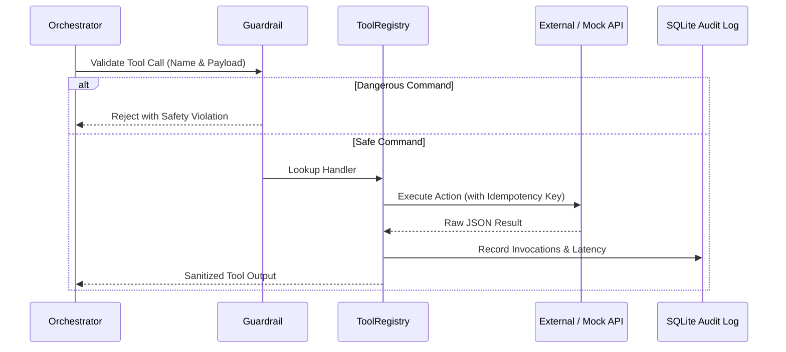

# ⚙️ Component Specification: Executor & Tool Dispatcher

## 1. Overview & Responsibility
The **Executor** is the runtime environment that safely executes tools requested by the Planner. It provides sandboxing, argument validation (via Pydantic), exponential backoff retries, and strict idempotency enforcement.

---

## 2. Execution Pipeline



---

## 3. Core Safety & Resilience Mechanisms

### 3.1 Pydantic Schema Validation
Before invoking any Python tool handler, arguments are parsed and validated against strict Pydantic models. Type mismatches or missing required fields return an immediate feedback message to the LLM to self-correct without crashing the process.

### 3.2 Idempotency Manager
Write operations (such as creating Jira/ServiceNow tickets or scheduling firmware updates) derive an idempotency hash:
```python
idempotency_key = hashlib.sha256(
    f"{server_id}:{action}:{target_component}:{date_hour}".encode()
).hexdigest()
```
If an identical action has been executed within the time window, the Executor returns the existing ticket ID rather than dispatching a duplicate request.

### 3.3 Transient Error Backoff & Fallback
Network timeouts to mock Redfish APIs trigger up to 3 exponential retries (`100ms`, `200ms`, `400ms`). If all retries fail, a structured `ToolExecutionError` is returned to the agent's observation stream.

---

## 4. Tool Registry Interface

```python
class ToolResult(BaseModel):
    tool_name: str
    success: bool
    data: Any
    error_message: Optional[str] = None
    execution_time_ms: float
    idempotency_key: Optional[str] = None
```
