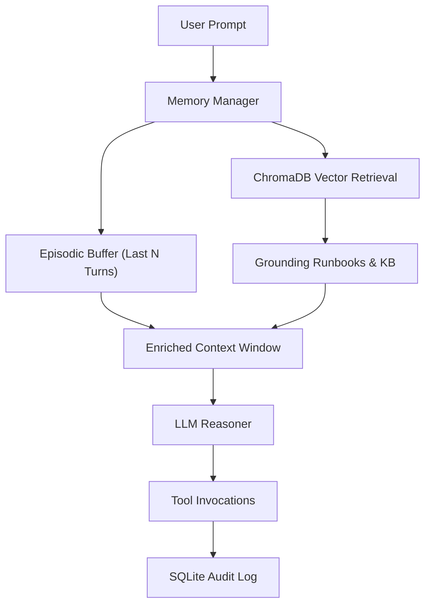

# 🧠 Component Specification: Multi-Tier Memory Systems

## 1. Overview & Architecture
Enterprise infrastructure agents require multiple memory tiers to balance real-time reasoning speed, long-term domain knowledge, multi-turn conversation coherence, and regulatory audit compliance.

```
┌────────────────────────────────────────────────────────────────────────┐
│                        Multi-Tier Memory Engine                        │
├───────────────────┬────────────────────────────────────────────────────┤
│ Tier 1: Working   │ Ephemeral Scratchpad (Current ReAct loop trace)    │
├───────────────────┼────────────────────────────────────────────────────┤
│ Tier 2: Episodic  │ Sliding-window conversation buffer (Token-capped)  │
├───────────────────┼────────────────────────────────────────────────────┤
│ Tier 3: Semantic  │ ChromaDB Local Vector Store (Runbooks, KB, Alerts) │
├───────────────────┼────────────────────────────────────────────────────┤
│ Tier 4: Structured│ SQLite Persistent DB (Audit trails, Idempotency)   │
└───────────────────┴────────────────────────────────────────────────────┘
```

---

## 2. Memory Tier Details

### 2.1 Tier 1: Working Memory (Scratchpad)
- **Scope**: Current execution cycle.
- **Contents**: Unprocessed observations, active step counter, hypothesis list.
- **Eviction**: Cleared upon task completion or terminal state.

### 2.2 Tier 2: Episodic Memory (Conversation Buffer)
- **Scope**: Multi-turn session context.
- **Budget**: Max 4,000 tokens allocated for conversation history.
- **Strategy**: Token-aware sliding window with summarization of older dialogue turns.

### 2.3 Tier 3: Semantic Memory (ChromaDB / Local Vector Store)
- **Scope**: Persistent technical documentation, vendor knowledge bases, Dell PowerEdge repair manuals, SMART error codes, and incident post-mortems.
- **Embedding Model**: Fast local embedding representation (`all-MiniLM-L6-v2` or lightweight numpy-based cosine similarity engine).
- **Retrieval Mechanism**: Top-$K$ semantic similarity ($K=3$) with cosine distance threshold filter ($>0.65$).

### 2.4 Tier 4: Structured Persistent Store (SQLite)
- **Scope**: Cross-session telemetry and compliance.
- **Schema**:
  - `executions`: `task_id`, `prompt`, `plan`, `final_response`, `duration_ms`, `created_at`.
  - `tool_invocations`: `task_id`, `tool_name`, `args_json`, `result_json`, `status`.
  - `idempotency_records`: `idempotency_key`, `resource_id`, `response_payload`, `timestamp`.

---

## 3. Data Flow Diagram


