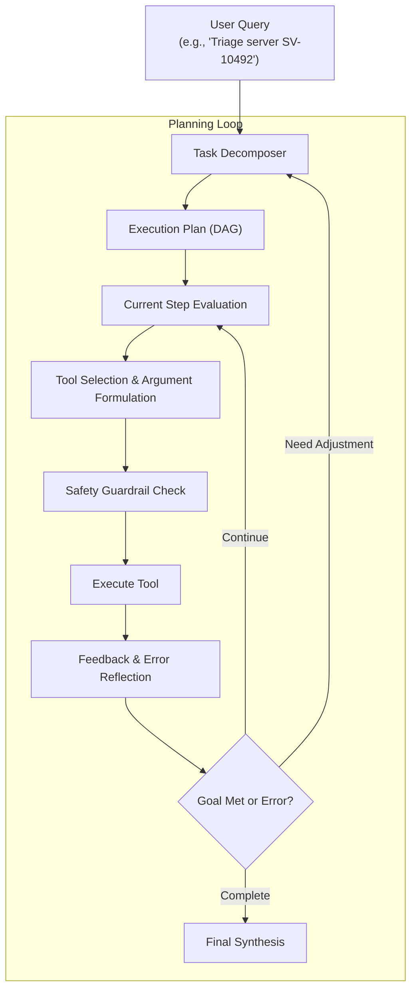

# 🧩 Component Specification: Planner & Reasoning Engine

## 1. Overview & Responsibility
The **Planner** is the cognitive engine responsible for decomposing high-level, ambiguous infrastructure queries into deterministic, executable steps. It supports both **ReAct (Reason + Act)** iterative loops and **Plan-and-Solve (DAG-based)** multi-step task breakdowns.

---

## 2. Planning Paradigms



### 2.1 ReAct Loop (Interleaved Reasoning & Acting)
- In single-incident triage, the agent uses a ReAct pattern:
  1. `Thought: Analyze current disk SMART telemetry for drive 0:1:2`
  2. `Action: redfish_query_storage(server_id='SV-10492')`
  3. `Observation: Reallocated_Sector_Ct = 184 (Threshold: 50)`
  4. `Thought: Reallocated sectors exceed threshold. Query RAG for Dell PowerEdge PERC H740P replacement runbook.`
  5. `Action: rag_search_runbook(query='PERC H740P disk replacement procedure')`
  6. `Observation: Runbook KB-8821 found: Hot-swap supported; rebuild will initiate automatically.`
  7. `Thought: Submit replacement ticket with idempotency key.`
  8. `Action: submit_service_ticket(server_id='SV-10492', component='Drive 0:1:2', priority='CRITICAL')`

### 2.2 Plan-and-Solve (Topological DAG Execution)
- For fleet patch operations, the Planner generates a Directed Acyclic Graph (DAG) of tasks:
  - Step 1: Drain workload & live-migrate virtual machines.
  - Step 2: Verify iDRAC / Lifecycle Controller connectivity.
  - Step 3: Stage firmware payload into RAM buffer.
  - Step 4: Apply firmware and trigger warm reboot.
  - Step 5: Post-flight telemetry validation.

---

## 3. Self-Correction & Loop Detection
- **Loop Detector**: Checks if the agent attempts the exact same tool call with identical arguments consecutively. If detected, injects a system prompt reflection:  
  `"Warning: Detected repeated tool call with identical parameters. Please analyze prior failure and attempt an alternative diagnostic strategy."`
- **Max Iteration Limit**: Capped at 6 loops by default.

---

## 4. Interfaces & Data Contracts

```python
class StepPlan(BaseModel):
    step_id: int
    description: str
    tool_name: Optional[str] = None
    tool_arguments: Dict[str, Any] = Field(default_factory=dict)
    expected_outcome: str

class ExecutionPlan(BaseModel):
    task_id: str
    objective: str
    steps: List[StepPlan]
    risk_level: Literal["LOW", "MEDIUM", "HIGH", "CRITICAL"]
    requires_human_confirmation: bool
```
