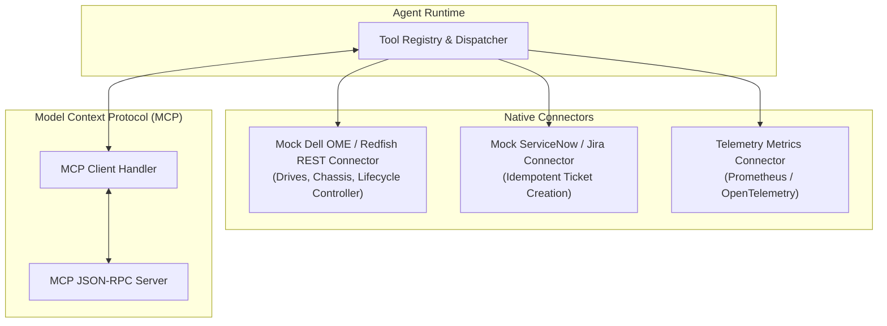

# 🔌 Component Specification: Tool Connectors & MCP Interface

## 1. Overview & Purpose
The **Tool Connectors** subsystem provides unified abstractions to bridge the Agent runtime with external infrastructure systems. It supports both native Python tool functions (for low-latency execution) and the **Model Context Protocol (MCP)** standard for interoperability across heterogeneous AI platforms.

---

## 2. Connectors Architecture



---

## 3. Connector Specifications

### 3.1 Dell OME / Redfish REST Connector (`src/connectors/mock_ome_api.py`)
- **Base Route**: `/redfish/v1/`
- **Endpoints**:
  - `GET /redfish/v1/Systems/{id}`: Basic system overview and power state.
  - `GET /redfish/v1/Systems/{id}/Storage/Drives`: Drive status, predictive failure flags, SMART attributes.
  - `POST /redfish/v1/Systems/{id}/Actions/ComputerSystem.Reset`: System reboot with `GracefulRestart` or `ForceRestart`.
  - `GET /redfish/v1/TelemetryService/MetricReports`: CPU temperature, fan RPM, PCIe bus errors.

### 3.2 Mock Ticketing Connector (`src/connectors/mock_ticketing_api.py`)
- **Endpoint**: `POST /api/v1/tickets`
- **Headers**: `X-Idempotency-Key: <SHA256_HASH>`
- **Payload Schema**:
  ```json
  {
    "server_id": "SV-10492",
    "service_impact": "CRITICAL",
    "category": "HARDWARE_STORAGE_FAILURE",
    "title": "Predictive Failure: Drive 0:1:2 Reallocated Sectors Exceeded",
    "remediation_runbook_id": "KB-8821",
    "automated_dispatch": true
  }
  ```

### 3.3 Model Context Protocol (MCP) Interface (`src/tools/mcp_server.py`)
- Adheres to the Anthropic MCP specification.
- Exposes tools via standard JSON-RPC 2.0 messages:
  - `list_tools`: Returns JSON Schema definitions for all registered tools.
  - `call_tool`: Executes requested tool with validated arguments and returns formatted content payloads.
