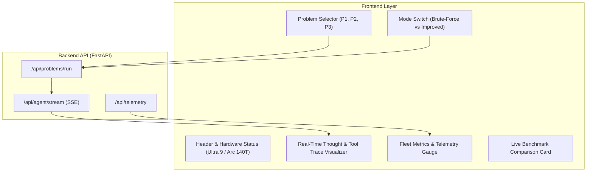

# 🖥️ Component Specification: User Interface & Observability Dashboard

## 1. Overview & Goals
The **UI & Observability Dashboard** provides an intuitive, high-performance interface for infrastructure operators and AI engineers. It allows users to interact with the agent, inspect thought traces in real time, view telemetry streams, and run comparative evaluations.

---

## 2. Key Features & Design System
- **Aesthetic**: Premium Dark Mode Glassmorphism (Tailored HSL color palette, smooth gradients, Lucide iconography, micro-animations).
- **Thought Trace Visualizer**: Live step-by-step rendering of Agent internal states:
  - 🧠 `THOUGHT`: Internal chain of reasoning.
  - 🛠️ `ACTION`: Tool invocation name and payload.
  - 👁️ `OBSERVATION`: Sanitized tool output and error status.
  - 💡 `SYNTHESIS`: Grounded final response with actionable recommendations.
- **Server-Sent Events (SSE)**: Streaming responses from FastAPI backend (`/api/agent/stream`) with zero UI lag.
- **One-Click Problem Runner**: Pre-loaded buttons to execute the 3 problem statements (Disk Health, Patch Automation, Log Triage) in both **Brute-Force** and **Improved** modes.

---

## 3. UI Component Architecture

