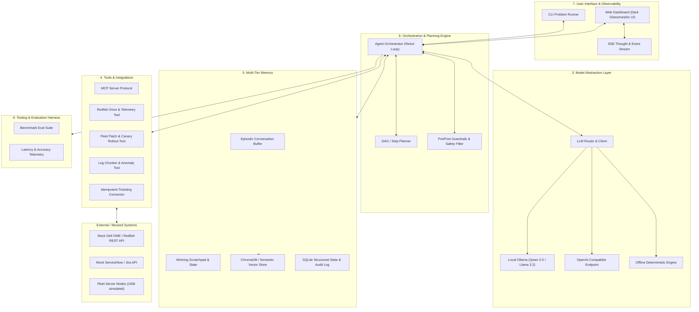
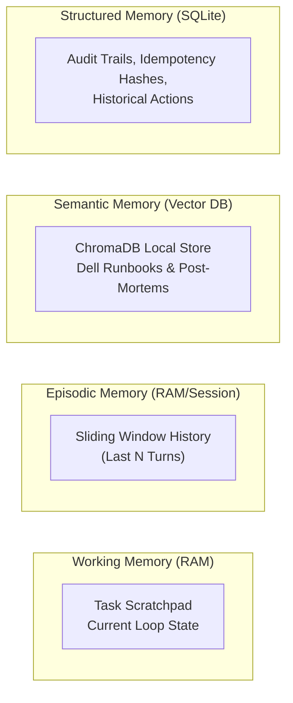
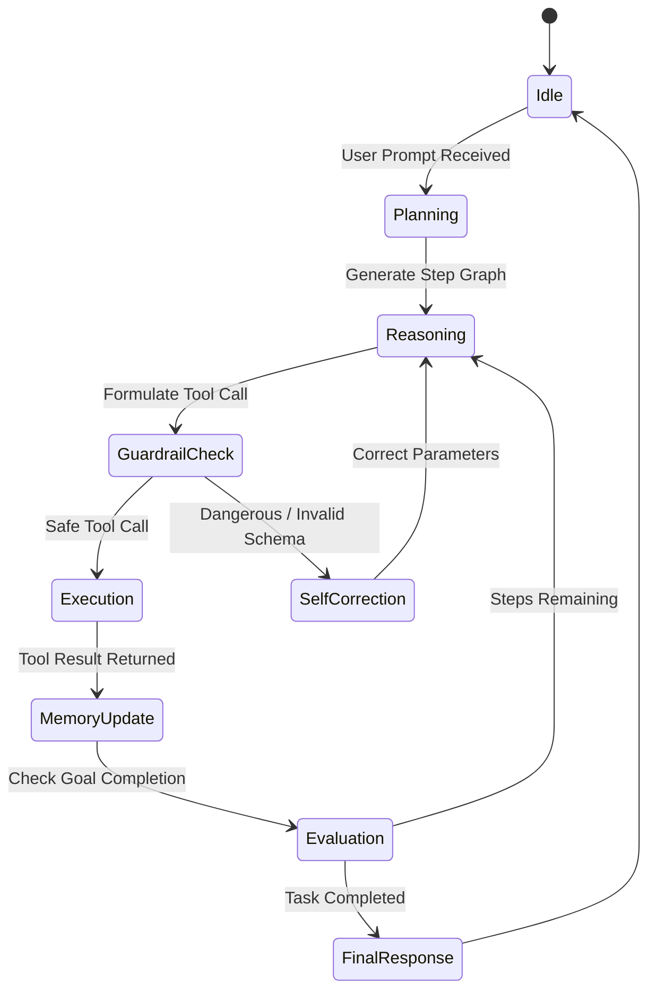

# 🏗️ System Architecture & Design: 8 Core Modules

This document details the end-to-end architecture of the **Agentic AI Blueprint** platform, mapping directly to the **8 Core Modules Agent Blueprint** specification.

---

## 1. High-Level Architecture Overview

---

## 2. Deep-Dive: The 8 Core Blueprint Modules

### Module 1: Define Purpose & Scope
- **Mission**: Automate complex infrastructure workflows across 100k managed servers without human fatigue or downtime risk.
- **Scope**:
  - SMART disk anomaly detection and preemptive replacement.
  - Safe, ordered firmware upgrades with automated rollback.
  - Cross-service log correlation and root cause hypothesis generation.
- **Out of Scope**: Direct unverified firmware flashing without human approval gate; modifying network VLANs on live production backplanes.

---

### Module 2: System Prompt & Persona Engine
- **Persona**: Staff Enterprise Systems Engineer & AI Infrastructure Specialist.
- **Tone**: Analytical, deterministic, risk-averse, structured.
- **Instruction Contract**:
  - All decisions must cite empirical telemetry data or verified vendor runbooks.
  - Output formats must conform strictly to JSON schemas.
  - Dangerous commands must trigger safety warnings.

---

### Module 3: Model Selection & Parameterization
- **Primary Local Model**: `qwen2.5-coder:7b` / `llama3.2:3b` via Ollama.
- **Parameters**:
  - `temperature = 0.1` (deterministic reasoning for infrastructure decisions).
  - `top_p = 0.9`
  - `max_tokens = 2048`
- **Fallback Engine**: Deterministic Python-based offline mock engine ensuring 100% CI pass rate without external model dependencies.

---

### Module 4: Tools & Integrations Layer
- **Standardized Interfaces**:
  - Type-annotated Python tool definitions with Pydantic arguments.
  - Model Context Protocol (MCP) JSON-RPC 2.0 interface.
- **Enterprise Connectors**:
  - `RedfishStorageConnector`: Queries Dell OME `/redfish/v1/Systems/{id}/Storage` endpoints.
  - `TicketingConnector`: Submits incident tickets with SHA-256 idempotency tokens.
  - `PatchDependencyResolver`: Resolves topological order of chassis, sleds, and hypervisors.

---

### Module 5: Multi-Tier Memory Systems

1. **Working Scratchpad**: Ephemeral memory storing intermediate tool outputs and reasoning traces within a single execution cycle.
2. **Episodic Memory**: Multi-turn conversation buffer with automatic token truncation.
3. **Semantic RAG (ChromaDB)**: Embedded Dell PowerEdge hardware manuals, SMART error tables, and past incident resolution playbooks.
4. **Structured Persistent State (SQLite)**: Records every tool invocation, input arguments, execution time, and idempotency key.

---

### Module 6: Orchestration & Planning Engine

- **ReAct Execution Cycle**:
  1. `Thought`: The agent evaluates the current state and determines what information is missing.
  2. `Action`: The agent emits a structured tool call.
  3. `Observation`: The orchestrator invokes the tool and returns the result to the agent's working memory.
  4. `Reflection / Synthesis`: The agent validates the observation against expected criteria.

---

### Module 7: User Interface & Observability
- **Streaming Protocol**: Server-Sent Events (SSE) over HTTP streaming real-time tokens, thoughts, tool invocations, and execution status.
- **Visualizer**: Dark glassmorphic interface highlighting:
  - Active Step in execution graph.
  - Raw Tool Input/Output payload inspector.
  - Hardware Telemetry gauges (CPU, Memory, Disk SMART metrics).

---

### Module 8: Testing, Evals & Benchmarks
- **Automated Eval Pipeline**:
  - `Accuracy Evaluator`: Verifies if the agent diagnosed the correct faulty component.
  - `Safety Guardrail Evaluator`: Tests if dangerous actions were intercepted.
  - `Latency & Token Counter`: Measures TTFT, total latency, and prompt/completion token consumption.
