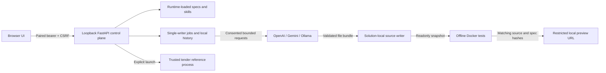

# Local developer workbench

The workbench packages a browser UI and a Python/FastAPI control API with this
repository. It reads the maintained templates, schemas and skills **at runtime**.
It is a local development tool, not a public service, production certification or
a promise that arbitrary software can be built without domain expertise.

## Start after cloning

Prerequisite: Python 3.11+ on PATH. Docker and an LLM are optional for browsing,
reading the cookbook and launching the included tender reference.

```powershell
git clone https://github.com/jpnaidu07/agentic-ai-blueprint.git
cd agentic-ai-blueprint
./workbench.ps1
```

On macOS/Linux run `bash workbench.sh`. A custom port is supported with
`./workbench.ps1 -Port 8081` or `bash workbench.sh 8081`.

The launcher creates a project virtual environment, installs pinned Python
dependencies and starts **http://127.0.0.1:8080**. Paste the local pairing token
printed in your terminal into the UI. Do not share the token or expose the port.
Ctrl+C stops the workbench and processes/containers it manages. For an already
installed checkout, `python -m src.workbench.server` starts without reinstalling.

Pairing uses a random session bearer token and CSRF token held only in browser
memory. There are no session cookies or localStorage/sessionStorage credentials:
cookies are not port-scoped and could leak to a generated app on another local
port. Refreshing the browser requires pairing again. Server sessions expire after
eight hours; disconnect or restart to release API keys earlier. An in-flight call
retains its key until it returns at its bounded safe cancellation point.

## Walk through the UI

1. **Overview:** learn the project and six workflow stages. Explore the included
   tender application or start a different business problem.
2. **Setup & models:** detect CPU, RAM, available memory, disk, GPU names, Docker
   and Ollama. Choose OpenAI, Gemini or local Ollama. Enter an exact model ID or
   list the account's available models. Set token/context budgets, consent to data
   transfer, then run the structured-output connection probe.
3. **Solutions:** enter a name, problem and constraints. The connected model reads
   `skills/capability/SKILL.md` and `templates/use-case.yaml` and produces a strict
   capability proposal. Unknown business decisions remain in `open_questions`.
4. Generate **design**, then **decomposition**, or all remaining stages. The model
   reads each relevant skill and current upstream specs. Schemas, module order,
   paths and dependency graphs are validated before a stage is published.
5. Inspect actual YAML/Markdown in the artifact viewer. YAML edits update the
   paired Markdown and preserve a local backup. Changing upstream specs makes
   downstream digests/approval stale. Review/edit downstream YAML in order; saving
   a reviewed design/decomposition refreshes its upstream digest. Do not approve
   until the proposals are concrete and unknowns are resolved.
6. Approve the exact current spec version. Select next/all/task/skill or a numbered
   module, optionally including unfinished dependencies. Authorize scoped source
   writes and data transfer. You can generate only, or enable isolated tests.
7. **Run history:** see lessons, activity, observed provider usage, files, tests and
   manual actions. A bounded all-run processes up to 12 tasks from the selected
   graph; resume for remaining work. It never loops indefinitely or spends without
   bounded calls. Cancellation takes effect between bounded operations, not by
   pretending a network request can be recalled.
8. **Applications:** launch the tender reference or a verified generated Python
   preview. A URL is returned only after startup and a health check.

The advice box is read-only: it can explain a model choice or the next task, but
cannot grant approval, install software or run an embedded command. Structured
actions use visible controls, allowlisted arguments and explicit confirmation.
Advice includes the detected CPU/RAM/GPU/tool summary, selected model and selected
solution specs in the consented provider request; no host username or filesystem
paths are included in that hardware summary. Failed acceptance results are retained
and provided to the next attempt at the same task. A failed check is shown as
**needs attention**, never as a completed engineering task.

## Components and trust boundaries



The model proposes source and explanations. The API owns permissions, file boundaries,
dependency checks and system actions; model text cannot grant itself a new tool.

## Model selection and local inference

OpenAI and Gemini use fixed official origins; arbitrary proxy URLs are deliberately
not accepted by this local control plane. Ollama uses only
`http://127.0.0.1:11434`. The reusable library still supports additional providers
described in [provider guidance](providers.md); they need separately reviewed
workbench connectors. No live API credential is included.

Model listings show account availability. The probe checks one schema-valid
response and reports actual latency/usage. It does **not** establish extraction
quality, reasoning quality or which model is best for a use case. Advice should be
treated as a proposed choice, followed by representative acceptance/evaluation
cases. Prices and model access are not hard-coded claims.

The local shortlist is intentionally small: Qwen3 4B and 8B through Ollama, with
conservative estimated working-memory budgets of 6/10 GiB and about 12 GiB reserved
for the OS, browser, editor and application services. These estimates are not
measured minimums; context/KV cache, quantization and GPU sharing change the result.
The UI also checks current free RAM and disk. A 32 GiB Intel laptop is a candidate
for these small-model experiments, not a guaranteed high-performance inference
machine. Intel GPU acceleration is unverified; Ollama's Vulkan path is experimental.

Ollama installation uses a fixed Winget package on Windows or Homebrew formula on
macOS when available, after the user confirms installation and terms. Linux and
machines without a supported package manager get the official download/manual
steps. The app never pipes a downloaded script into a shell. Starting the runtime
and downloading an allowlisted model are separate confirmed actions. Docker/WSL2,
drivers, OS dialogs or reboots can require manual steps.

Verified documentation references (2026-08-30):

- [OpenAI model listing](https://developers.openai.com/api/reference/resources/models/methods/list)
  and [structured outputs](https://developers.openai.com/api/docs/guides/structured-outputs).
- [Gemini OpenAI compatibility](https://ai.google.dev/gemini-api/docs/openai).
- [Ollama Windows](https://docs.ollama.com/windows), [hardware support](https://docs.ollama.com/gpu),
  [Qwen3 4B](https://ollama.com/library/qwen3:4b) and [Qwen3 8B](https://ollama.com/library/qwen3:8b).
- [Xata Agent](https://xata.io/database-agent) inspired the explicit setup/integration/
  playbook separation. No Xata code, branding or database-agent functionality is copied.

## What actually gets implemented

For new solutions, model output is a validated bundle of changed source files,
lessons, verification instructions and manual prerequisites. The writer can write
only to `solutions/<name>/implementation/runtime/`. It cannot change repository
skills, setup scripts, Git configuration, dependencies, secret files or host paths.
It never executes a model-generated shell command or installs model-selected
packages. Existing files are snapshotted before changes; there are no generated
deletions. Inputs/source are bounded in size and stale generation results are rejected.

The first supported preview contract is Python/FastAPI with `app.py` exporting
`app`, a `GET /api/health` endpoint, same-origin UI, and `tests/test_*.py`. The
maintained runner image includes the pinned repository dependencies. Other stacks,
extra dependencies, external databases/services and production deployment require
an explicit reviewed extension or manual handoff. This is intentionally not an
unrestricted remote shell disguised as a UI.

Build the runner once in Setup, or explicitly run:

```powershell
docker build -f infra/Dockerfile.runner -t agent-blueprint-runner:local .
```

Tests run in a non-root container with no network, no provider keys, no host home
or repository mount, read-only source, dropped capabilities, no-new-privileges,
1 GiB memory, two CPUs, 128 processes and a 120-second time limit. Docker is a
development isolation boundary, not a guarantee against kernel/container exploits.
Do not execute hostile third-party code on a sensitive host.

Successful checks with no reported unmet acceptance can create a **workbench-agent
attestation** and immutable tested source snapshot. Later tasks can legitimately
modify shared runtime files; their new tests validate the integrated state. A
separate launch ledger binds the latest successful test to the current source/spec
digests, so editing the runtime after verification blocks launch. Agent-authored
tests are not independent proof of business completeness. Deployment never gets
an automatic production-completion receipt.

Generated previews run on an internal Docker network with a loopback-only published
port, no keys and temporary `/data` storage. Restart loses that preview data.
[Docker internal networks](https://docs.docker.com/reference/cli/docker/network/create/#internal)
restrict external connectivity but are not a substitute for host firewalling and
VM-level isolation. Persistent production storage and external integrations need
their own reviewed design.

## Government tender end-to-end

The reference is trusted repository source mapped in
[its implementation guide](../solutions/government-tender-processing/implementation/README.md).
It is already implemented, so the UI prepares teaching plans rather than allowing
an LLM to rewrite shared `src/` files. To extend that source, execute the displayed
plan with a coding agent/developer and review changes normally.

Choose **Applications → Launch tender portal**. The workbench starts a distinct
trusted Python process on a free loopback port with a persistent SQLite database
under ignored `.workbench/`. It creates separate admin/evaluator/reviewer/viewer
tokens and does not inherit the workbench API connection or `.env` credentials.
Reveal/copy the appropriate development role token and sign in to the portal:

1. As admin, create a tender and its explicit criteria/weights.
2. As evaluator, add bidders and upload digital PDF evidence.
3. Inspect pages; accept numeric facts with exact quotes, units and criteria.
4. Run deterministic evaluation. Missing or uncertain evidence blocks ranking.
5. Use **Ask & discover** for bidder inventory, top ranks, L1, missing evidence,
   approval state or cited excerpts. No generated SQL is executed. This reference's
   free-text fallback returns source excerpts, not synthesized LLM conclusions.
6. Sign in as the separate reviewer to approve/reject the evaluation. Approval is
   not an automatic procurement award. Inspect the audit trail and evidence.

Tender data persists across launches; local tokens rotate. Do not use confidential
documents before production identity, malware isolation, encryption, retention,
procurement rules and independent review are complete. Document-to-model extraction
remains an explicitly configured separate opt-in in the original API deployment;
the workbench launch does not silently enable it.

## Local API and state

Source: `src/workbench/`. The UI and API are same-origin. Host/Origin/client-IP
checks reject remote access and browser rebinding attempts. Mutating endpoints
need the paired session bearer and CSRF token. Body limits and non-reflective
validation errors protect key inputs. No generic file, shell, URL-fetch or process
endpoint is provided. All paired sessions control the same local checkout; this is
single-developer software, not a multi-tenant service.

Important API groups: `/api/session`, `/api/system`, `/api/providers`,
`/api/connection`, `/api/catalog`, `/api/solutions`, `/api/jobs`, `/api/actions`,
`/api/apps`, and `/api/ask`. State and revision/test snapshots live under ignored
`.workbench/`; solution specs/source/evidence remain reviewable in `solutions/`.
Run metadata persists in SQLite; interrupted jobs are marked interrupted on restart.
Only one mutating job runs at a time. Do not run multiple workbench workers or two
instances against the same checkout. Review generated artifacts before committing;
the workbench does not commit/push or publish anything automatically.

Stop the server before manually removing `.workbench/` to reset local run history,
snapshots and tender data; doing so deletes that local tender database. Do not
delete solution artifacts merely to reset a session. See
[the validation report](validation-report.md) for actual executed checks and limits.

Snapshots/history accumulate until you deliberately archive or remove them; this
version has no automated retention policy. Monitor disk space and back up any local
tender data you want to retain. Do not put sensitive briefs or API keys in a synced
checkout; ignoring files in Git does not exclude them from OneDrive or other backup tools.
