# 🔍 Industry Problem 3: Distributed Log Triage & Root Cause Analysis (RCA)

## 1. Problem Statement
In microservices-based platforms like Dell Polaris, an incident (e.g. device inventory sync latency spike) produces cascading error logs across dozens of decoupled services (OME Polaris Core, Kafka event ingest, Redis cache clusters, PostgreSQL lock managers). When on-call SREs inspect hundreds of megabytes of raw logs, finding the true root cause amid noisy downstream error cascades takes hours.

The goal is to build an autonomous agent that ingests multi-service log streams, applies semantic chunking and error clustering, correlates events across service boundaries, queries historical incident post-mortems via vector search, and outputs a confidence-scored root cause hypothesis with a reproducible verification script.

---

## 2. Two-Stage Solution Architecture

```mermaid
graph TD
    subgraph "Stage 1: Brute-Force Baseline"
        BF_Logs["Raw Multi-Service Logs"] --> BF_Grep["Regex Grep / Full Dump"]
        BF_Grep --> BF_LLM["LLM Context Stuffing"]
        BF_LLM --> BF_Summary["Vague Summary\n(Misses Root Cause, Context Overflow)"]
    end

    subgraph "Stage 2: Production Improved Agent"
        IMP_Logs["Multi-Service Log Stream"] --> IMP_Parser["Semantic Chunker & Error Clusterer"]
        IMP_Parser --> T1["Tool: Cross-Service Correlation"]
        T1 --> D1["Temporal Alignment (Kafka lag -> Postgres lock -> OME timeout)"]
        D1 --> IMP_Orch["ReAct RCA Orchestrator"]
        IMP_Orch --> T2["Tool: local lexical fixture search"]
        T2 --> D2["Historical Incident Match (INC-4029: DB Connection Starvation)"]
        D2 --> IMP_Orch
        IMP_Orch --> T3["Tool: Reproducible Test & Fix Synthesizer"]
        T3 --> D3["Automated DB Pool Config Patch & Test Script"]
        D3 --> IMP_RCA["Confidence-Scored RCA Report"]
    end
```

---

## 3. Engineering Comparison

| Dimension | Stage 1: Brute-Force | Stage 2: Production Improved |
| :--- | :--- | :--- |
| **Context Window Handling** | Ingests raw logs; exceeds token limit | Semantic chunking & error clustering (90% token reduction) |
| **Cross-Service Correlation**| Evaluates services in isolation | Temporal alignment across Kafka, PostgreSQL, and OME API |
| **Historical Grounding** | None | synthetic lexical matching |
| **Actionable Fix** | Generic advice ("check DB") | Exact PostgreSQL connection pool tuning patch + test script |
| **Confidence Scoring** | None | Calibrated score (0.0 to 1.0) with evidence citations |
