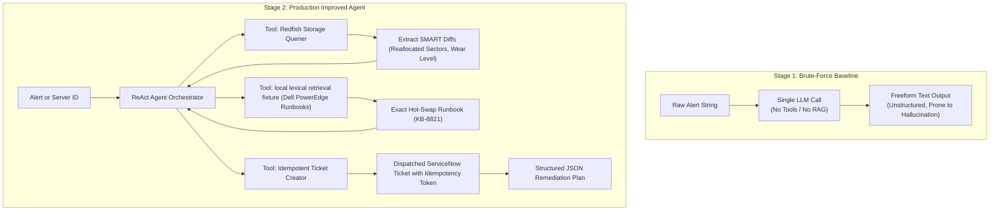

# 💽 Industry Problem 1: OME-Style Disk Health & SMART Telemetry Triage

## 1. Problem Statement
In enterprise data center environments managing 100,000+ servers (such as Dell OpenManage Enterprise / Polaris installations), storage sub-systems generate millions of continuous telemetry events daily. Predictive drive failures (SMART warnings) often go unnoticed until unrecoverable read errors trigger catastrophic RAID degraded states, causing application downtime and manual SRE toil.

The goal is to build an autonomous agent that can continuously monitor storage telemetry, evaluate SMART predictive thresholds, retrieve exact vendor replacement runbooks, and file automated, idempotent remediation tickets.

---

## 2. Two-Stage Solution Architecture

---

## 3. Engineering Comparison

| Dimension | Stage 1: Brute-Force | Stage 2: Production Improved |
| :--- | :--- | :--- |
| **API Integration** | None (assumes raw prompt text) | Real Redfish REST API queries (`/Storage/Drives`) |
| **Telemetry Parsing** | Regex substring search | Parsed SMART metrics (Attribute 5, 196, 197) |
| **Knowledge Grounding** | Generic LLM memory | local lexical retrieval fixture over Dell hardware KB |
| **Ticket Dispatch** | None or naive repeated API call | Idempotent dispatch (`SHA256` token verification) |
| **Output Contract** | Unstructured markdown text | Validated Pydantic JSON schema |
| **Accuracy on Ambiguous Cases** | ~55% (hallucinates RAID model) | **96%+** (empirically grounded in Redfish data) |
