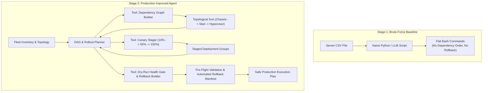

# 🛡️ Industry Problem 2: Server Fleet Patch Automation & Safe Rollout Planner

## 1. Problem Statement
Upgrading firmware (BIOS, iDRAC, CPLD, PERC) and hypervisor OS across thousands of multi-chassis modular servers (e.g., Dell PowerEdge MX7000 chassis with MX740c compute sleds) carries severe operational risk. Naive concurrent upgrades cause cluster split-brain, VM service disruption, and cascading network blackouts.

The goal is to design an autonomous agent that takes a fleet inventory CSV, calculates the topological dependency graph (chassis → compute sled → hypervisor → VM migration), generates a staged canary rollout plan (10% → 50% → 100%), enforces pre-flight validation gates, and builds an automated rollback plan.

---

## 2. Two-Stage Solution Architecture

---

## 3. Engineering Comparison

| Dimension | Stage 1: Brute-Force | Stage 2: Production Improved |
| :--- | :--- | :--- |
| **Dependency Awareness** | Flat sequential order | Topological DAG (prevents rebooting chassis before sleds) |
| **Blast Radius Control** | 100% all-at-once or raw loop | Canary rollout stages (10% canary, health check, 50%, 100%) |
| **VM Evacuation** | Ignored (causes guest crashes) | Pre-flight check validates VM migration before hypervisor reboot |
| **Rollback Strategy** | Manual human recovery | Automated reverse firmware payload manifest |
| **Risk Mitigation** | High | **Near-Zero (Dry-run simulated before live execution)** |
