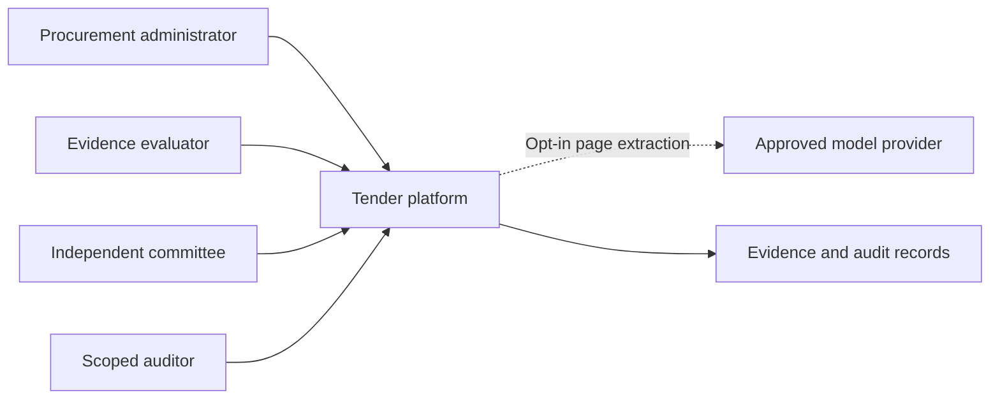
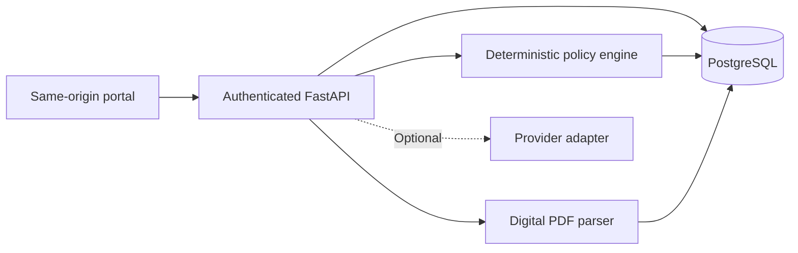
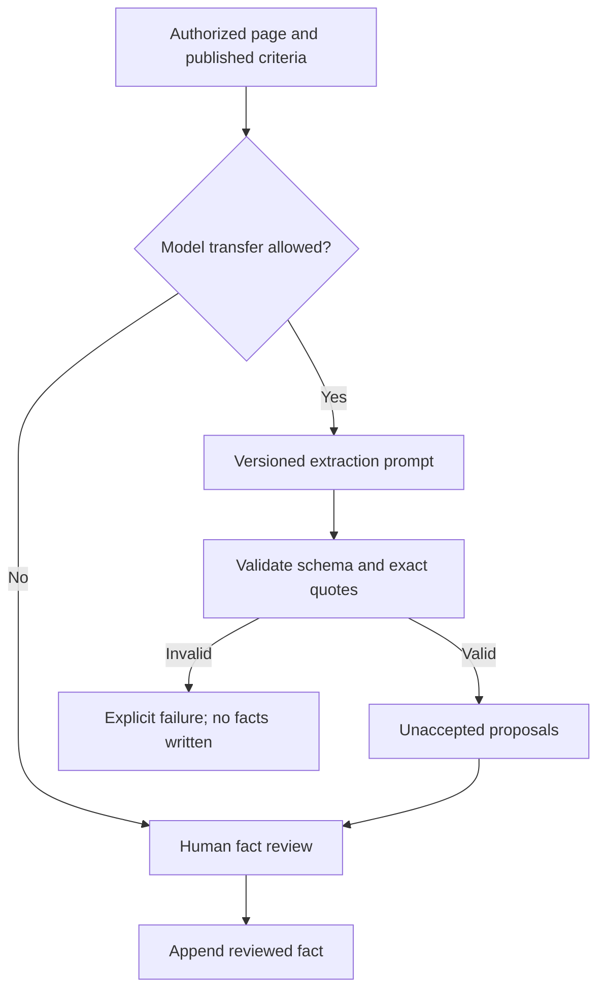
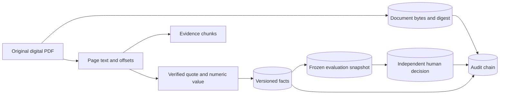
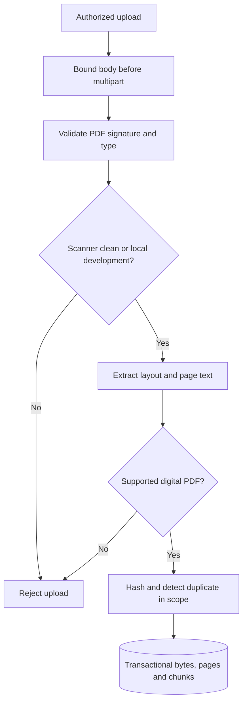
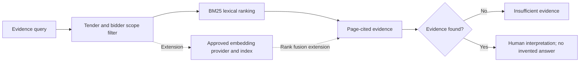
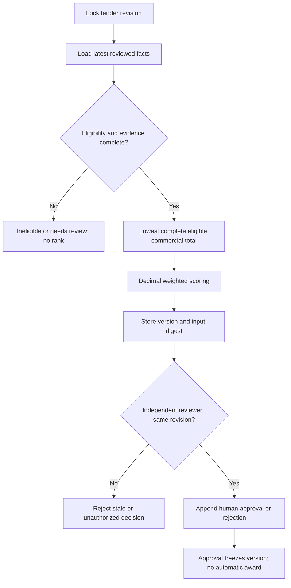
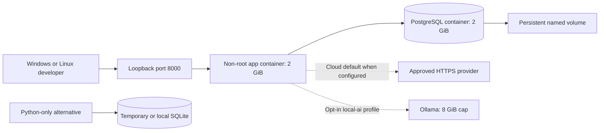

# Tender architecture diagrams
Solid lines describe the reference. Dotted lines mark optional or planned integrations.

## System Context

## Container Architecture

## Agent Workflow

## Data Flow

## Document Ingestion

## Rag Flow

## Evaluation Workflow

## Deployment Architecture

